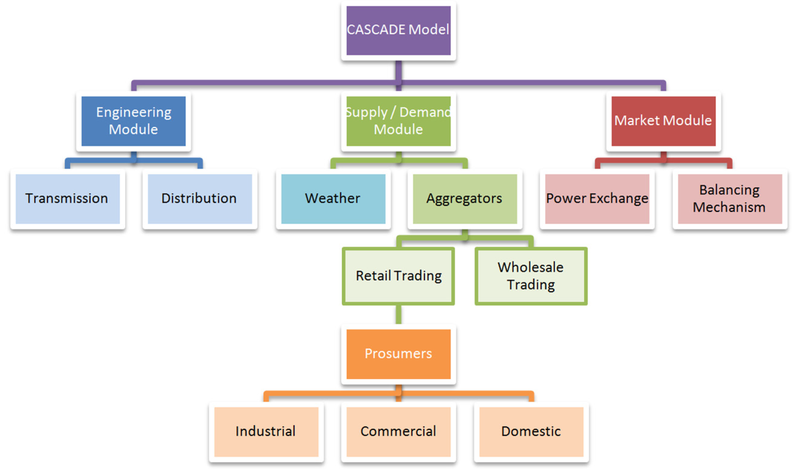

# CASCADE (Complex Adaptive Systems, Cognitive Agents and Distributed Energy) model

incorporating:

# ASTEM (Agent-based Short Term Electricity Market) model

This is an electricity system & market agent-based framework developed for the Complex Adaptive Systems, Cognitive Agents and Distributed Energy (CASCADE) project. 

It mainly consists of the following integrants:
- Supply and Demand 
- Energy market 
- Engineering components 

The ASTEM (Agent-based Short Term Electricity Market) model is integrated in the CASCADE model and consist of the following components: 

## Installation

Clone the repository to your local machine:

`git clone https://github.com/babak2/CASCADE_ASTEM.git`

or if you have the program as a ZIP file, simply extract the zip file to a directory of your choice.

Change your working directory to CASCADE_ASTEM:

`cd CASCADE_ASTEM`

## Required programs

The CASCADE model was developed using Repast Simphony 2.0 version along with the following external programs/libraries: 

1)	Repast Simphony 2.0
2)	commons-math-2.2.jar
3)	commons-mathforsimplex-2.2.jar
4)  flanagan.jar
5)  RandomHelper.class

## Input files: 

Input files can be found in the `dataFiles` directory. These include the typical household demand baseline with different numbers of occupants, and entire one-year weather profiles, among other files.

## License

This program is licensed under the GNU GENERAL PUBLIC LICENSE. See LICENSE for more information.

## Contact 

Babak Mahdavi Ardestani

babak.m.ardestani@gmail.com