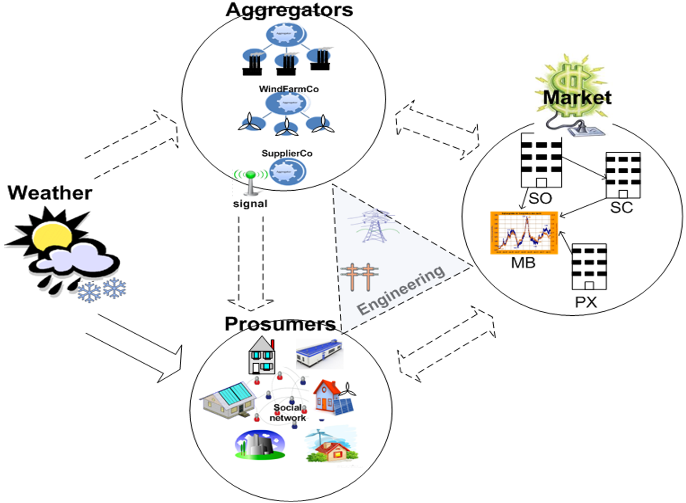
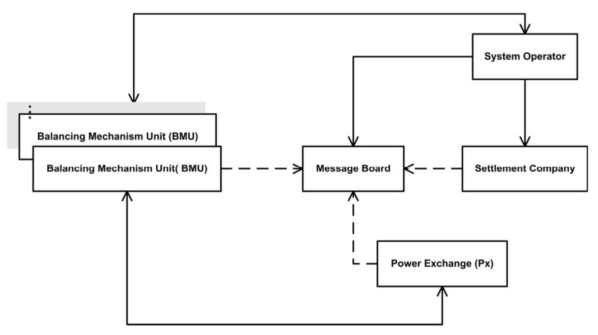
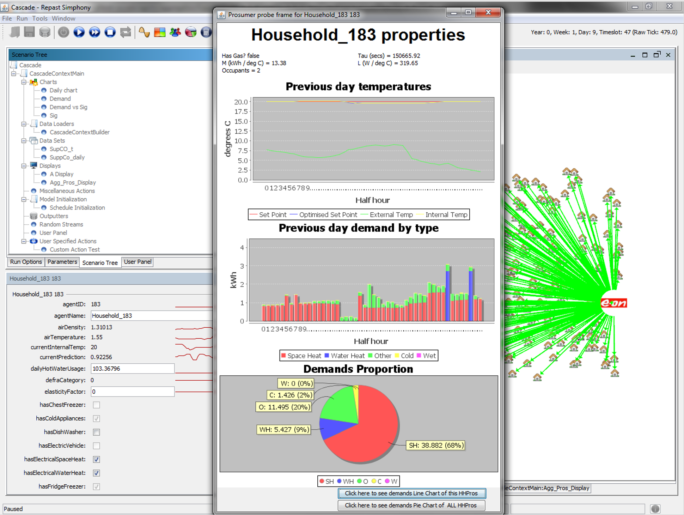

# CASCADE (Complex Adaptive Systems, Cognitive Agents and Distributed Energy) model

incorporating:

# ASTEM (Agent-based Short Term Electricity Market) model

This is an electricity system & market agent-based framework developed for the Complex Adaptive Systems, Cognitive Agents and Distributed Energy (CASCADE) project. 

It mainly consists of the following components:

- Supply and Demand (all, excluding the Energy Market)
- Engineering components (e.g., transmission, distribution, ...)
- Energy Market

Prosumers can encompass a wide range of entities, spanning from pure consumers to pure generators. For example, prosumers may include households, non-domestic consumers, entities with energy storage capabilities, and full-scale energy generators.

Aggregators, on the other hand, are typically commercial entities that play a role in the energy industry. These entities can include energy companies like supplierCo, windfarmCo, coalGenCo (coal generation company), CCGTCo (Combined Cycle Gas Turbine company), and others. Aggregators often operate within the energy market, facilitating the distribution, trading, or management of energy resources.

The ASTEM (Agent-based Short Term Electricity Market) model is integrated in the CASCADE model and consist of the following components: 

A reinforcement learning algorithm is employed to enable the agents participating in energy market trading to learn from their past bidding experiences and dynamically adjust their strategies to maximize cumulative rewards over time.

## Installation

Clone the repository to your local machine:

`git clone https://github.com/babak2/CASCADE_ASTEM.git`

or if you have the program as a ZIP file, simply extract the zip file to a directory of your choice.

Change your working directory to CASCADE_ASTEM:

`cd CASCADE_ASTEM`

## Required programs

The CASCADE model was developed using Repast Simphony 2.0 version along with the following external programs/libraries: 

1)	Repast Simphony 2.0
2)	commons-math-2.2.jar
3)	commons-mathforsimplex-2.2.jar
4)  flanagan.jar
5)  RandomHelper.class

## Input files: 

Input files can be found in the `dataFiles` directory. These include the typical household demand baseline with different numbers of occupants, and entire one-year weather profiles, among other files.

For example, the initial demands of household prosumers, based on the number of occupants and including factors such as gas usage, cold appliances, wet appliances, and electrical hot water, are stochastically initialized using one of the input files.
 

## License

This program is licensed under the GNU GENERAL PUBLIC LICENSE. See LICENSE for more information.

## Contact 

Babak Mahdavi Ardestani

babak.m.ardestani@gmail.com